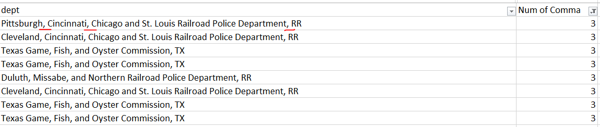
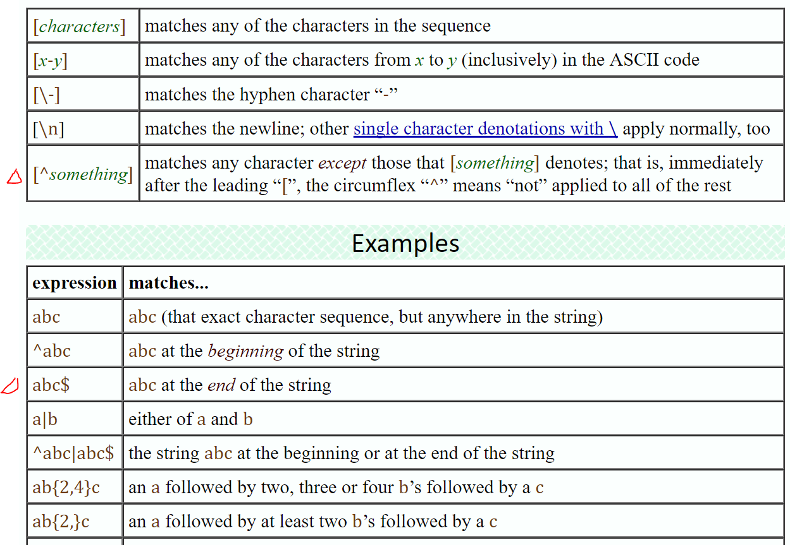

## Regular Expression
[Basic](http://jkorpela.fi/perl/regexp.html)  
[Look ahead and behind](https://stackoverflow.com/questions/2973436/regex-lookahead-lookbehind-and-atomic-groups)  
* **(?!)** - negative lookahead
* **(?=)** - positive lookahead
* **(?<=)** - positive lookbehind
* **(?<!)** - negative lookbehind

### Examples
Given the string foobarbarfoo:
```
bar(?=bar)     finds the 1st bar ("bar" which has "bar" after it)
bar(?!bar)     finds the 2nd bar ("bar" which does not have "bar" after it)
(?<=foo)bar    finds the 1st bar ("bar" which has "foo" before it)
(?<!foo)bar    finds the 2nd bar ("bar" which does not have "foo" before it)
```
You can also combine them:
```
(?<=foo)bar(?=bar)    finds the 1st bar ("bar" with "foo" before it and "bar" after it)
```
### Definitions
#### Look ahead positive (?=)
Find expression A where expression B follows:
```
A(?=B)
```
#### Look ahead negative (?!)
Find expression A where expression B does not follow:
```
A(?!B)
```
#### Look behind positive (?<=)
Find expression A where expression B precedes:
```
(?<=B)A
```
#### Look behind negative (?<!)
Find expression A where expression B does not precede:
```
(?<!B)A
```
### Case
Find the last comma below
    
```
dept_state <- strsplit(clean_data$dept, ",(?=[^,]+$)", perl=TRUE)
```
Based on the chart below, it's looking for the comma with no comma before it.
  